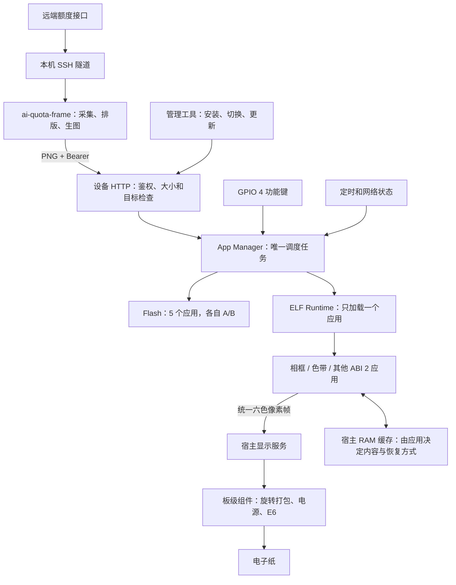
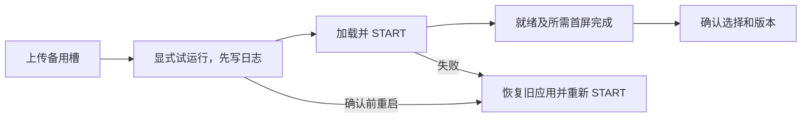

# PhotoPainter 仓库职责与架构

整个系统可以理解成“电脑制作内容，设备运行应用，屏幕负责显示”。四个仓库分别保存一部分工作；它们不需要一起编译，但要遵守共同的接口。

## 四个仓库做什么

| 仓库 | 在哪里运行 | 负责什么 | 更新产物 |
|---|---|---|---|
| `esp32s3` | 不运行 | 入口、说明、架构图 | 文档 |
| `ai-quota-frame` | 电脑 | 采集 Codex/Grok/Kimi 等额度，排版成 800×480 六色 PNG，按计划推送 | Go 程序与本地服务 |
| `photopainter-host` | ESP32-S3 | Wi-Fi、鉴权、HTTP、安装目录、A/B、应用切换；提供显示、缓存和时间服务，拥有 ABI 2 板级驱动 | 宿主固件 `.bin` |
| `photoframe` | 由设备宿主加载 | 相框、色带等应用；解码或生成内容，决定启动时显示什么 | 每个应用独立 `.app.elf`；另保留旧 `.so` |

例如：把额度页面的字体放大，只改电脑端；相框启动时换一张等待页，只改相框应用；修改 GPIO 或屏幕电源时序，则改宿主的板级组件。

## 一张图看运行过程

HTTP 不直接切换 ELF，按键不直接刷屏，应用不修改 Flash 槽。管理器安排执行顺序，应用生成自己的内容，显示服务将统一像素帧交给固定硬件。电脑端通过 HTTP 推送图片，不控制当前应用选择。

`esp32s3` 不在运行链路中。设备没有远端额度管理密钥，也不直接访问额度接口；密钥只留在电脑端。设备鉴权令牌与 Wi-Fi 配置仍由宿主管理。

## 应用如何运行和切换

这里的应用是一份 ELF 代码，不是手机上的独立进程。当前最多安装 **5 个应用**，每个应用有两个 1 MiB 版本槽，同一时间只运行其中一个。A/B 表示升级前后两个版本，不能算成 10 个应用。

ABI 是宿主与应用约好的调用规则。ABI 2 接收 START、INPUT、TIMER、NETWORK_CHANGED、STOP 五种事件；每次处理完都要报告结果。两个真实应用的 START 已实现自主页面：

| 场景 | 实际执行 |
|---|---|
| 开机进入相框 | 有可用 RAM 缓存则恢复图片；重启后缓存通常为空，显示 WAITING FOR IMAGE |
| 电脑推来额度图 | 相框完整解码验色，然后调用宿主显示服务；成功后保存可选帧缓存 |
| 短按切到色带 | 相框 STOP → 卸载 → 色带 START → 自行生成六色帧 → 刷屏 → 确认选择 |
| 短按切回相框 | 相框 START 自己选择恢复缓存或等待页，不需要电脑先发送触发图片 |
| 色带运行时额度服务推图 | 默认目标仍是相框，宿主返回 409；不会抢回相框或把额度画进色带 |
| 更新色带 | 写色带备用槽，显式 activate 启动新版；相框的两个槽保持不变 |
| 未来增加时钟 | 应用在 START 显示时间或“时间未设置”，登记定时事件；切出后宿主取消定时器 |

GPIO 4 短按在空闲时循环选择有 active 版本的 ABI 2 应用。忙时、长按或启动时按住不会积压多次切换。pending 更新不会被按键偷偷激活。BOOT 和电源键保持原功能。

## 哪些耦合是必要的

“耦合”是两部分必须知道彼此的约定。例如插头和插座需要相同规格，这种联系是必要的；但插座不需要知道接入的是台灯还是风扇。

本次运行层把宿主与应用的联系收窄到 SDK、事件、逻辑帧和明确的返回结果。宿主不再要求所有应用先收到 PNG，也不写“相框要恢复哪张图”这类业务分支。相框决定内容，宿主保证显示接口和资源顺序。

| 连接 | 仍需共同遵守的约定 | 修改影响 |
|---|---|---|
| 电脑 → 宿主 | 端口 80、Bearer、原始 PNG、最大 5 MiB、HTTP 状态 | 改协议需两端兼容 |
| 电脑 → 相框 | 800×480、非隔行、完全不透明、精确六色 | 改图像格式需生成与解码两端验证 |
| 宿主 → ABI 2 应用 | SDK 字段布局、manifest、允许导入、事件与结果码 | 新服务或接口变化需兼容宿主 |
| 应用 → 显示服务 | 从左上逐行的 384000 字节六色索引帧 | 应用不再自行旋转或使用 GPIO/SPI |
| 宿主板级组件 → 硬件 | 固定引脚、电源和 E6 时序 | 更换硬件需要更新宿主 |

构建仍独立：宿主不调用兄弟应用工程，不嵌入业务 ELF。页面逻辑升级只更新应用；板级驱动升级需要更新宿主。设备两仓固定使用同一 ESP-IDF 提交和未修改的 Registry elf_loader 1.3.3。

仍然存在原生代码共享内存的限制：应用不是沙箱，严重故障可能使设备重启。ABI 2 禁止直接导入任务/ISR/硬件 API，用宿主定时事件替代后台回调。缓存是有上限且可失败的 RAM，不是断电保存的相册。

## 兼容、确认与恢复

旧 ABI 1 仍能运行，保留原 PNG 桥接和 ELF 内的显示驱动，但没有 START 首屏，故功能键跳过它。CLI 仍能选择它，首次推图后确认。ABI 2 在 START 正确就绪且完成声明所需首屏后确认；无显示测试应用也可以确认。

开机的已确认应用也有独立启动保护日志：active 失败只尝试 previous 一次；previous 也失败就停止应用执行，保留可用的鉴权管理能力，避免两个坏版本无限重启。损坏目录或保护记录不会被擦除或猜测恢复。

推图 HTTP 200 仍表示本次实体刷新和最终 POWER_OFF 等待完成；“ELF 已加载”“应用就绪”“版本已确认”是不同状态。状态接口分别提供 `ready`、`runtime_ready`、`confirmed` 与最近事件的显示凭据。电子纸保留旧图不代表设备此刻正在运行那个应用。

## 操作和验收入口

- [应用运行层、功能键、SDK 与状态字段](https://github.com/M1nt-Ch0c0/photopainter-host/blob/codex/multi-wifi-apps/docs-runtime-v2.md)
- [本轮构建与实机验收记录](https://github.com/M1nt-Ch0c0/photopainter-host/blob/codex/multi-wifi-apps/docs/validation-runtime-v2.md)
- [五应用分区、SD/NVS 多 Wi-Fi 与管理命令](https://github.com/M1nt-Ch0c0/photopainter-host/blob/codex/multi-wifi-apps/docs-multi-apps.md)
- [应用构建与六色示例](https://github.com/M1nt-Ch0c0/photoframe/blob/codex/multi-wifi-apps/README.md)
- [电脑常驻服务与隧道](https://github.com/M1nt-Ch0c0/ai-quota-frame#macos-常驻运行)

Wi-Fi 的合法 SD JSON 权威性、原子迁移和备份规则不变。应用启动与 Wi-Fi 分开：未配网或网络不可达时，离线应用仍可运行。源码不保存密钥、设备备份或含凭据日志。
