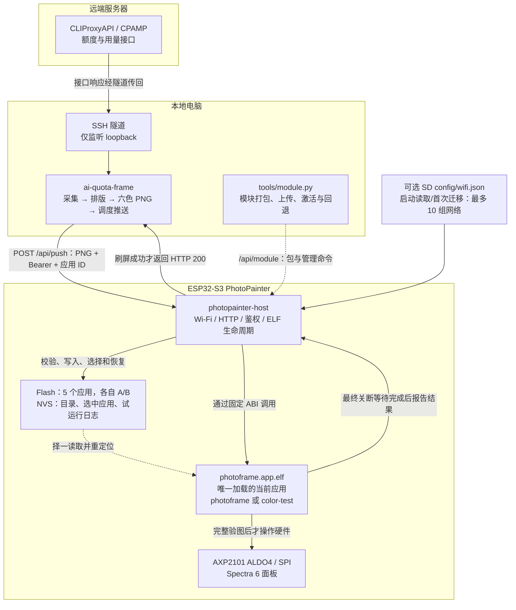
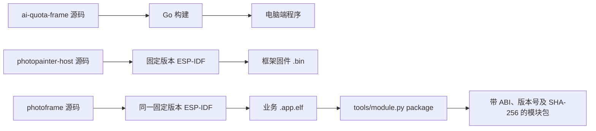
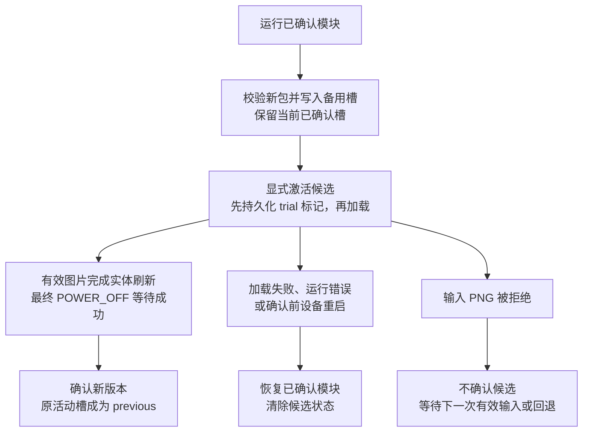

# PhotoPainter 仓库职责与架构

当前系统由四个仓库组成：`esp32s3` 提供索引和总览，三个实现仓库分别负责电脑端应用、设备框架和设备显示模块。设备应用独立打包、独立更新；每个应用保留自己的 A/B 版本，同一时刻只加载一个应用，通过约定的 ABI 在设备框架内运行。

多 Wi-Fi 和五应用目录的新实现与迁移命令见 [多应用指南](https://github.com/M1nt-Ch0c0/photopainter-host/blob/codex/multi-wifi-apps/docs-multi-apps.md)。多应用安装、更新、回退与重启恢复已完成真实设备验证，当前保留 photoframe 和独立 color-test 两个应用。SD 卡、两个真实网络的可控切换与人工画面检查仍待验收，见 [实机证据](https://github.com/M1nt-Ch0c0/photopainter-host/blob/codex/multi-wifi-apps/docs/validation-multi-app-hardware.md)。

## 1. 仓库分别做什么

| 仓库 | 运行位置 | 主要职责 | 主要产物 |
|---|---|---|---|
| [esp32s3](https://github.com/M1nt-Ch0c0/esp32s3) | 文档与开发入口 | 仓库索引、整体架构、部署文档导航 | Markdown 文档，不参与构建或设备运行 |
| [ai-quota-frame](https://github.com/M1nt-Ch0c0/ai-quota-frame) | 本地电脑，当前部署为 macOS | 从远端采集额度和用量；用 Chrome 排版并生成六色 PNG；调度、去重、排队和主动推送；提供常驻服务及 SSH 隧道安装器 | Go 程序、800×480 PNG、macOS LaunchAgent 和本地启动器 |
| [photopainter-host](https://github.com/M1nt-Ch0c0/photopainter-host) | ESP32-S3 | 启动、SD/NVS 多组配网、Wi-Fi、HTTP 鉴权、请求缓冲；ELF 包校验、应用目录、每应用 A/B 槽管理、单实例加载、确认与回退；维护固定宿主 ABI | 框架固件 `photopainter_host.bin`；电脑端管理工具 `tools/module.py` |
| [photoframe](https://github.com/M1nt-Ch0c0/photoframe) | ESP32-S3，由框架加载 | 完整 PNG 解码与六色校验；像素旋转/打包；AXP2101 电源、GPIO/SPI、Spectra 6 E6 刷新与关断 | 部署使用 `photoframe.app.elf`；另产出 `photoframe.so`，当前宿主不加载它 |

额度接口、页面布局和刷新计划属于 `ai-quota-frame`；网络接入及模块生命周期属于 `photopainter-host`；图像解码和真实面板操作属于 `photoframe`。因此“更换额度页面”和“升级显示驱动”是两条不同的更新路径。

## 2. 运行时架构图

实线描述取数、推图和显示路径；虚线描述模块管理与加载路径。图中远端到本机的箭头表示数据返回方向，连接由本机主动发起。`esp32s3` 是文档索引，不在运行链路内。

当前 macOS 部署有两个独立常驻任务：一个维护 SSH 隧道，一个运行采集/生图/推送程序。设备只接收 PNG 和模块包，不连接远端额度接口，也不需要远端管理密钥。

## 3. 耦合关系

### 构建与发布：三个实现仓库独立

框架构建不会调用 `photoframe` 的构建，也不把业务 ELF 嵌入固件。三个仓库放在同级目录只是开发便利，不是框架编译的前提。第一次完整部署需要同时准备框架与种子模块；之后 ABI 兼容的模块更新通过网络写入备用槽，无需重刷框架。

`esp-idf` 是工具链和 SDK 依赖，不是第五个业务仓库。设备端两仓固定使用提交 `5e6f53cdb31fe5708eae3f55af9737be2822db22`，并使用未修改的 Registry `elf_loader` 1.3.3。电脑端运行还需要 Chrome/Chromium；远端部署通过 SSH 隧道访问接口。

### 运行与兼容：依赖明确的接口契约

| 两端 | 耦合点 | 兼容要求 |
|---|---|---|
| 远端接口 ↔ `ai-quota-frame` | API 地址、鉴权、返回数据结构 | 接口变化时调整电脑端采集器 |
| `ai-quota-frame` ↔ `photopainter-host` | HTTP、独立 Bearer 令牌、PNG 输入和响应状态 | 原始 `image/png`，最大 5 MiB；只有推图 200 表示实体刷新及最终关断等待完成 |
| `ai-quota-frame` ↔ `photoframe` | 经宿主传递的图像格式 | 800×480、非隔行、完全不透明、精确六色；格式变化需同时调整生成端和解码端 |
| `photopainter-host` ↔ `photoframe` | ELF 格式、ABI 版本、导入符号、结果码和调用生命周期 | 当前 ABI 1；模块所需符号必须由宿主提供；每次调用必须报告结果 |
| `photoframe` ↔ 硬件 | GPIO、I²C/SPI、电源与 E6 时序 | 对应当前 PhotoPainter/Spectra 6 硬件，屏幕电源为 ALDO4 |

宿主与模块之间有三个 PNG/结果桥接函数，以及内存、FreeRTOS、GPIO、I²C、SPI 等系统导出。固定导出表由 `photopainter-host/main/host_abi.c` 维护；新增宿主尚未提供的导入不能仅更新业务 ELF。

构建和更新已经解耦，执行环境仍然耦合：业务 ELF 与宿主共享同一设备的内存、任务和硬件资源，**不是独立进程或安全沙箱**。模块出现崩溃可能导致设备重启。A/B 负责候选版本生命周期与重启恢复，不能隔离任意原生代码故障。推图和模块操作共用锁，避免模块执行时被切换。

## 4. A/B 更新与回退

每个应用的两个槽属于同一个框架固件，不是两份整机固件，也不会并行运行两个应用。五个应用各自有两个槽，全局只有一个应用的一个槽被加载执行。新上传只占用目标应用的备用槽，因此该应用旧 `previous` 版本可能被覆盖；它的当前已确认版本及其他应用的两个版本仍保留。切换到另一应用也先持久化试运行记录，实体刷新成功才确认选择，失败或重启恢复原应用。首次种子 A 是初始化基线，必须做真实刷屏验证后才能作为可用回退依据。手动 `rollback` 可取消待激活/试运行候选，或切回上一已确认版本。

## 5. 修改某项功能时，需要动哪些仓库

| 想改什么 | 主要修改位置 | 部署影响 |
|---|---|---|
| 额度来源、账号展示、页面布局、刷新间隔 | `ai-quota-frame` | 更新电脑端程序或配置，不改设备代码 |
| PNG 解码、像素处理、面板时序、电源设置 | `photoframe` | ABI 兼容时只更新模块包 |
| Wi-Fi、鉴权、HTTP、槽位日志、加载与回退策略 | `photopainter-host` | 更新框架固件，保留现有模块和状态分区 |
| 新增宿主导出、修改桥接函数签名或结果码 | `photopainter-host` + `photoframe` | 联合设计兼容方案并验证；旧模块可能不再兼容，不能直接套用普通模块更新流程 |
| 改分辨率、六色约束或 PNG 契约 | `ai-quota-frame` + `photoframe`，按需调整宿主限制 | 同时验证生成、协议校验与解码路径 |
| 改说明、导航和架构图 | `esp32s3` 及对应仓库文档 | 无运行时影响 |

## 6. 配置边界与详细文档

Wi-Fi 优先读取 SD 的合法 JSON 列表；首次缺失 JSON 时从 NVS 多组/单组配置或旧 wifi.txt 原子迁移，无卡时使用 NVS。合法空列表与损坏文件不会被旧凭据掩盖。私密文件管理工具支持追加网络、同名改密和调整顺序。推图令牌保存在设备 NVS；远端管理凭据只保存在电脑端受保护的本地配置中。模块仓库不保存任何凭据。模块管理与推图共用设备端鉴权和端口，管理响应 200 不等于屏幕刷新成功。源码仓库不包含真实密钥、NVS 镜像、Flash 备份或含凭据日志。

- [首次迁移、包格式、槽位状态与命令](https://github.com/M1nt-Ch0c0/photopainter-host/blob/main/docs-module-slots.md)
- [macOS 常驻部署与远端隧道](https://github.com/M1nt-Ch0c0/ai-quota-frame#macos-常驻运行)
- [组件接口、输入限制与硬件依据](https://github.com/M1nt-Ch0c0/photoframe)
- [实机验证记录](https://github.com/M1nt-Ch0c0/photopainter-host/blob/main/docs/validation-2026-09-06.md)
- [开发流程与约束](https://github.com/M1nt-Ch0c0/photopainter-host/blob/main/.agents/skills/develop-photopainter-stack/SKILL.md)
